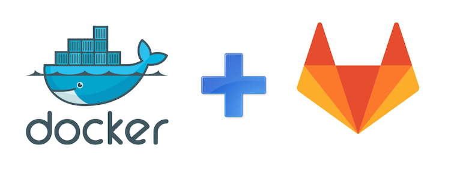

# Build and Test Laravel with Gilab-CI By Deha Academy



---
## Based on [PHP Images](https://hub.docker.com/_/php).
---

| Types         | Images (version)| 
| ------------- |:-------------:  | 
| Alpine        | [7.2](https://github.com/sanghvdeha/laravel-ci-php7-alpine/tree/master/php7.2)|

---
## Cấu hình Gitlab CI/CD
---
### 1. Cấu hình trên môi trường Staging, Production 
---

#### Tạo user 
```bash
# Tạo user deployer
sudo adduser deployer

# Cấp quyền deployer user đến thư mục/var/www
sudo setfacl -R -m u:deployer:rwx /var/www
```

#### Tạo SSH Key
```bash
ssh-keygen -t rsa -b 4096 -C "email@example.com"

Generating public/private rsa key pair.
Enter file in which to save the key (/Users/hoangsang/.ssh/id_rsa): 
/Users/hoangsang/.ssh/id_rsa already exists.
Overwrite (y/n)? y
Enter passphrase (empty for no passphrase): 
Enter same passphrase again: 
Your identification has been saved in /Users/hoangsang/.ssh/id_rsa.
Your public key has been saved in /Users/hoangsang/.ssh/id_rsa.pub.
The key fingerprint is:
SHA256:X/ljjz4+tireNtDCiPC6I3o7S3j2soY5bKvbLMMYEeg email@example.com
The key's randomart image is:
+---[RSA 4096]----+
|.                |
|o                |
|..               |
|.E  .        .   |
| .   o .So .o    |
|..    o ..+...   |
|=++  .    .o  +  |
|BX*.o     ..o.++ |
|*XBBoo   ..oo*=+.|
+----[SHA256]-----+
```

#### Thêm SSH Key
```bash
# Copy public key đến authorized_keys
cat ~/.ssh/id_rsa.pub >> ~/.ssh/authorized_keys

# Copy private key đến bộ nhớ tạm
cat ~/.ssh/id_rsa
```

#### Thêm Private Key vào Project Gitlab

